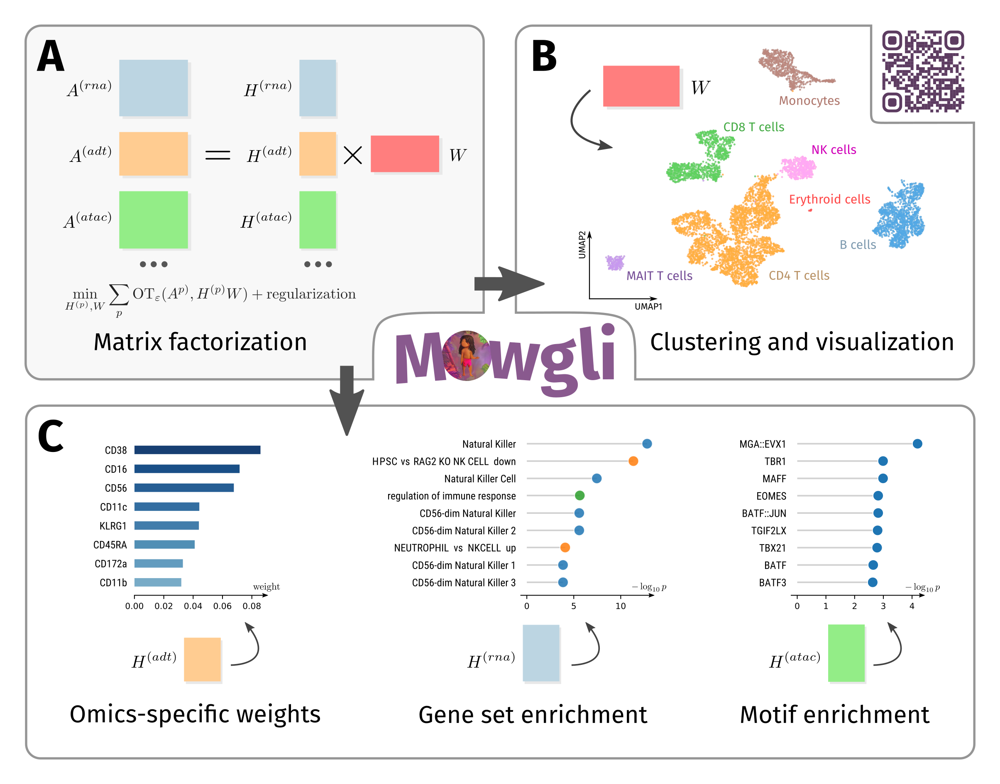

# Mowgli: Multi Omics Wasserstein inteGrative anaLysIs
[](https://github.com/gjhuizing/Mowgli/actions/workflows/main.yml)
[](https://codecov.io/gh/gjhuizing/Mowgli)

Mowgli is a novel method for the integration of paired multi-omics data with any type and number of omics, combining integrative Nonnegative Matrix Factorization and Optimal Transport. [Read the preprint!](https://www.biorxiv.org/content/10.1101/2023.02.02.526825v2)



## Install the package

Mowgli is implemented as a Python package seamlessly integrated within the scverse ecosystem, in particular Muon and Scanpy.

### via PyPI (recommended)

On all operating systems, the easiest way to install Mowgli is via PyPI. Installation should typically take a minute and is continuously tested with Python 3.8 on an Ubuntu virtual machine.

```bash
pip install mowgli
```

### via GitHub (development version)

```bash
git clone git@github.com:cantinilab/Mowgli.git
pip install ./Mowgli/
```

## Getting started

Mowgli takes as an input a Muon object and populates its `obsm` and `uns` fiels with the embeddings and dictionaries, respectively. Visit [mowgli.rtfd.io](https://mowgli.rtfd.io/) for more documentation and tutorials.

You may download a preprocessed 10X Multiome demo dataset [here](https://figshare.com/s/4c8e72cbb188d8e1cce8).

A GPU is not required for small datasets, but is strongly recommmended above 1,000 cells. On CPU, the [cell lines demo](https://mowgli.readthedocs.io/en/latest/vignettes/Liu%20cell%20lines.html) (206 cells) should run in under 5 minutes and the [PBMC demo](https://mowgli.readthedocs.io/en/latest/vignettes/PBMC.html) (500 cells) should run in under 10 minutes.

```python
import mowgli
import mudata as md
import scanpy as sc

# Load data into a Muon object.
mdata = md.read_h5mu("my_data.h5mu")

# Initialize and train the model.
model = mowgli.models.MowgliModel(latent_dim=15)
model.train(mdata)

# Visualize the embedding with UMAP.
sc.pp.neighbors(mdata, use_rep="W_OT")
sc.tl.umap(mdata)
sc.pl.umap(mdata)
```

## Our preprint

```bibtex
@article{huizing2023paired,
  title={Paired single-cell multi-omics data integration with Mowgli},
  author={Huizing, Geert-Jan and Deutschmann, Ina Maria and Peyre, Gabriel and Cantini, Laura},
  journal={bioRxiv},
  pages={2023--02},
  year={2023},
  publisher={Cold Spring Harbor Laboratory}
}
```

If you're looking for the repository with code to reproduce the experiments in our preprint, [here is is!](https://github.com/cantinilab/mowgli_reproducibility)
