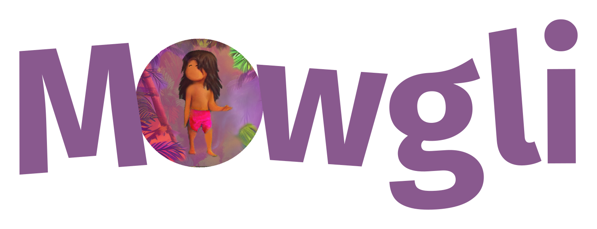

# Mowgli: Multi Omics Wasserstein inteGrative anaLysIs

<div style="text-align:center;"></div>

Mowgli is a novel method for the integration of paired multi-omics data with any type and number of omics, combining integrative Nonnegative Matrix Factorization and Optimal Transport. [Read the preprint!](soon)

## Install the package

Mowgli is implemented as a Python package seamlessly integrated within the scverse ecosystem, in particular Muon and Scanpy.

### via PyPI (recommended)

```bash
pip install mowgli
```

### via GitHub (development version)

```bash
git clone git@github.com:cantinilab/Mowgli.git
pip install ./Mowgli/
```

## Getting started

Mowgli takes as an input a Muon object and populates its `obsm` and `uns` fiels with the embeddings and dictionaries, respectively. Visit [mowgli.rtfd.io](https://mowgli.rtfd.io/) for more documentation and tutorials.

```python
from mowgli import models
import muon as mu
import scanpy as sc

# Load data into a Muon object.
mdata = mu.load_h5mu("my_data.h5mu")

# Initialize and train the model.
model = models.MowgliModel(latent_dim=15)
model.train(mdata)

# Visualize the embedding with UMAP.
sc.pp.neighbors(mdata, use_rep="W_OT")
sc.tl.umap(mdata)
sc.pl.umap(mdata)
```

## Citation
```bibtex
Preprint available soon!
```